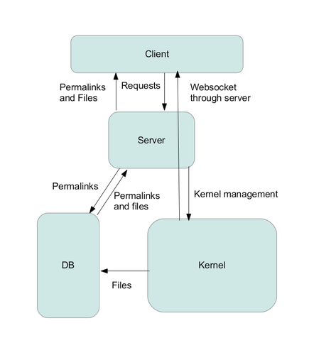

======================================
 Notes for Possible Future Directions
======================================

Goals
-----

* More scalable service that takes advantage of recent work by the iPython team to increase performance and vastly reduce code complexity

* Overall consistency with the iPython messaging scheme

Overall Design
--------------

Typical computation request::

    USER writes code to be executed
    CLIENT formats code into iPython execute_request message
    CLIENT sends request message to SERVER
    SERVER stores request message in DB and sends identifying permalinking back to client
    SERVER starts KERNEL session
    SERVER opens websocket/ZMQ connection linking CLIENT to KERNEL through SERVER
    SERVER sends request message to KERNEL through websocket
    KERNEL executes user code and sends output messages to CLIENT through websocket
    KERNEL uploads files to DB
    KERNEL notifies user of files in DB
    KERNEL session ends, websocket closes

Typical interact request::

    USER writes code to be executed
    CLIENT formats code into iPython execute_request message
    CLIENT sends request message to SERVER
    SERVER stores request message in DB and sends identifying permalking back to client
    SERVER starts KERNEL session
    SERVER opens websocket/ZMQ connection linking CLIENT to KERNEL through SERVER
    SERVER sends request message to KERNEL through websocket
    KERNEL executes user code and sends output messages to CLIENT through websocket
    USER sends additional request messages to KERNEL through websocket
    KERNEL continues to execute user code and sends output messages to CLIENT
    KERNEL uploads files to DB
    KERNEL notifies user of files in DB
    KERNEL session ends, websocket closes

Significant Changes
-------------------

Server:

* The biggest change is a preference towards using websockets, rather than a continuing request/reply model managed by the client

* However, as a fallback, we should still support something like long-polling for a mobile app API or in other scenarios where websockets are not available

* In terms of software, the plan is to switch to Tornado from Flask, since Tornado is designed for high performance, scalability, and the type of request model we want to support (websockets, long polling, etc). Tornado can also be run behind nginx for more scalability.

Database:

* The DB no longer serves as a buffer for messages back to the server, only as a storage location for files and permalinks.

* Specific software TBD, especially since it plays a much smaller role than before.

Kernel Backend:

* Specifics TBD. At minimum, this should have some separation of "trusted" and "untrusted" portions so that arbitrary user code can theoretically be run without any sort of recourse on a separate account and/or machine.

* Hopefully, we can use and/or extend iPython's built-in parallel architecture along with a websocket/zmq bridge to eliminate most of the current multiprocessing device code.

Client Javascript:

* The goal is to use javascript from the iPython notebook as the basis for session management, because it introduces useful features such as an integrated event system built on top of jQuery events as well as a heavier focus on callback functions, etc.

Notes on using IPython workers
------------------------------

Issues when migrating to using IPython 0.12+ hub and engines:

* We'd have to figure out a way to spawn an engine easily by forking a process, with custom initialization and cleanup (like putting files in a directory and cleaning up the files afterwards).

* We'd need to have a way to "wrap" any messages sent out, to translate them GAE channel messages, for example.  The IPython notebook seems to do this already with their websocket/zmq bridge.

